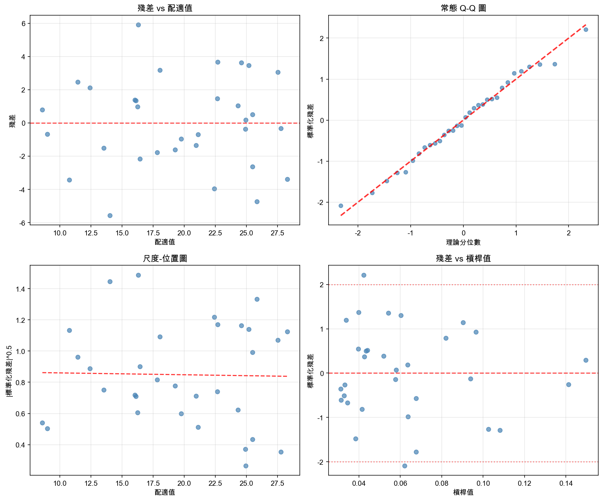
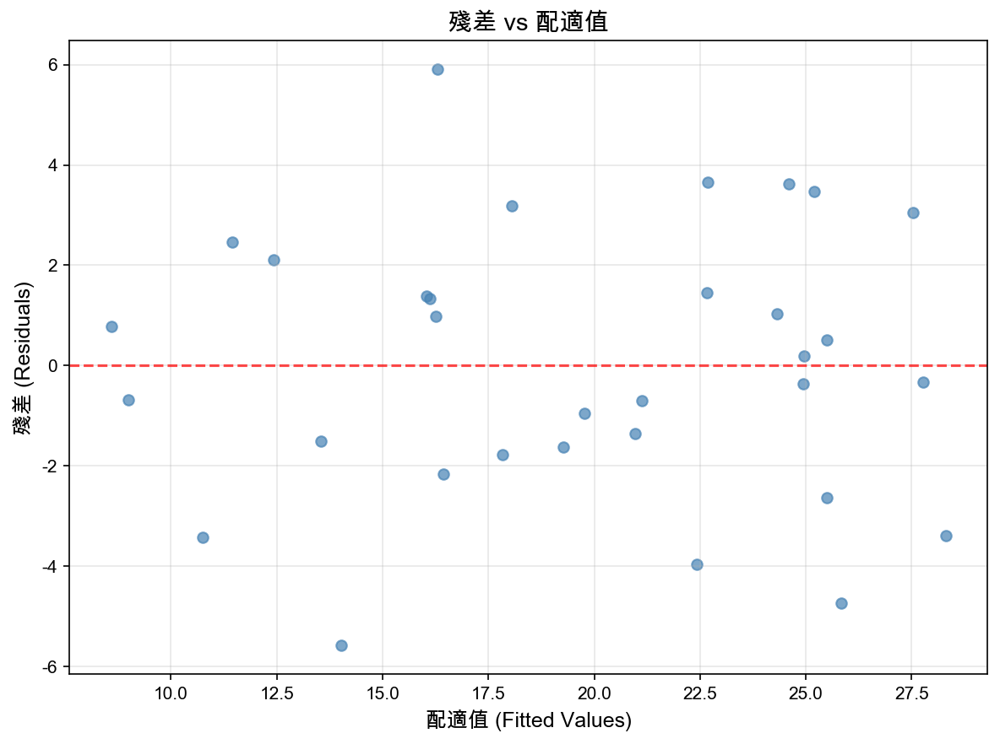
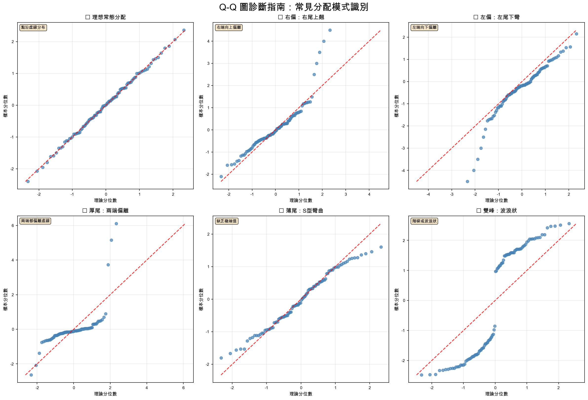
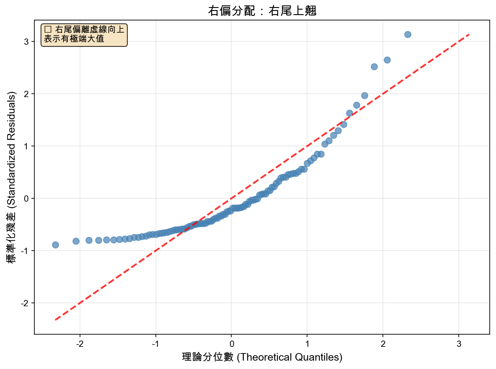
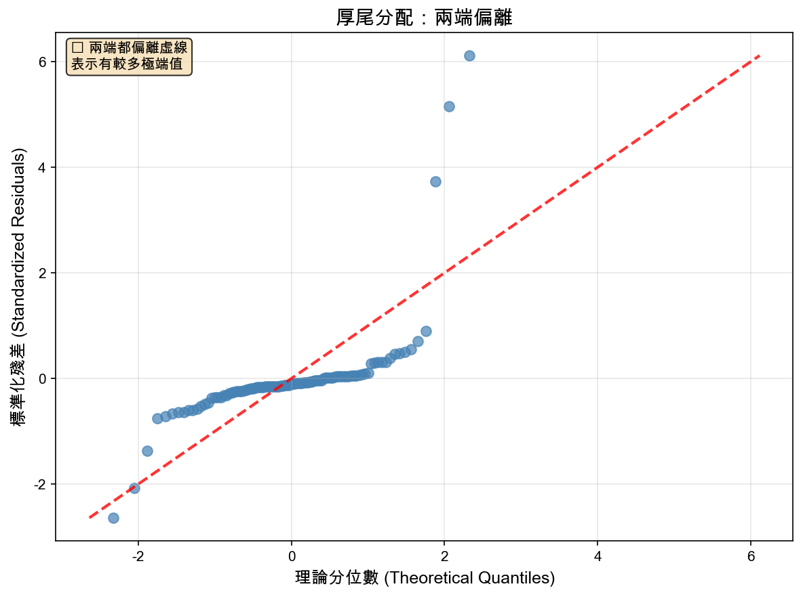
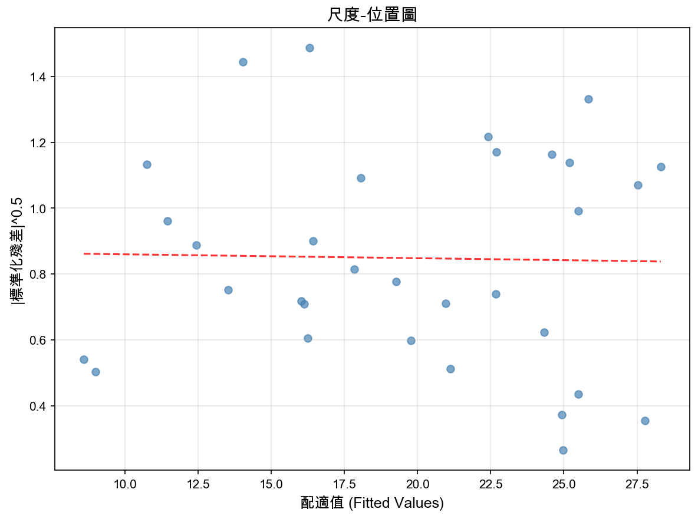
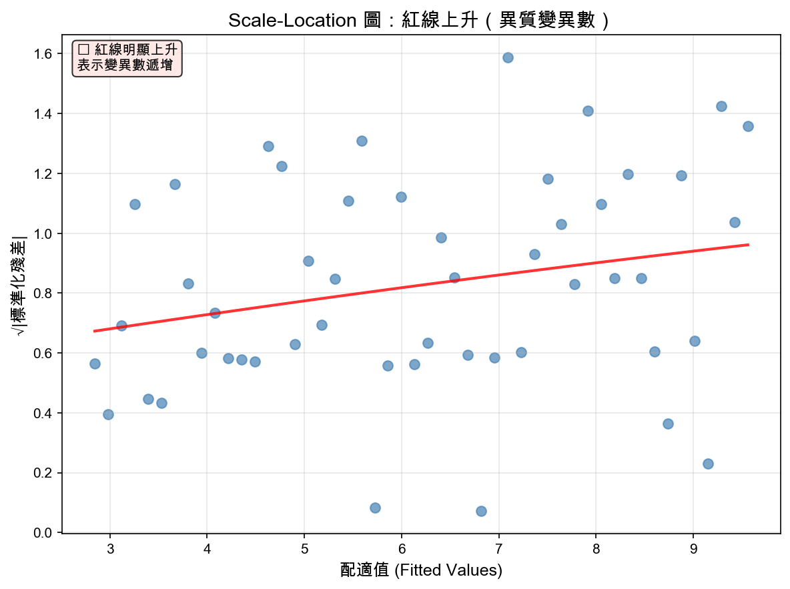
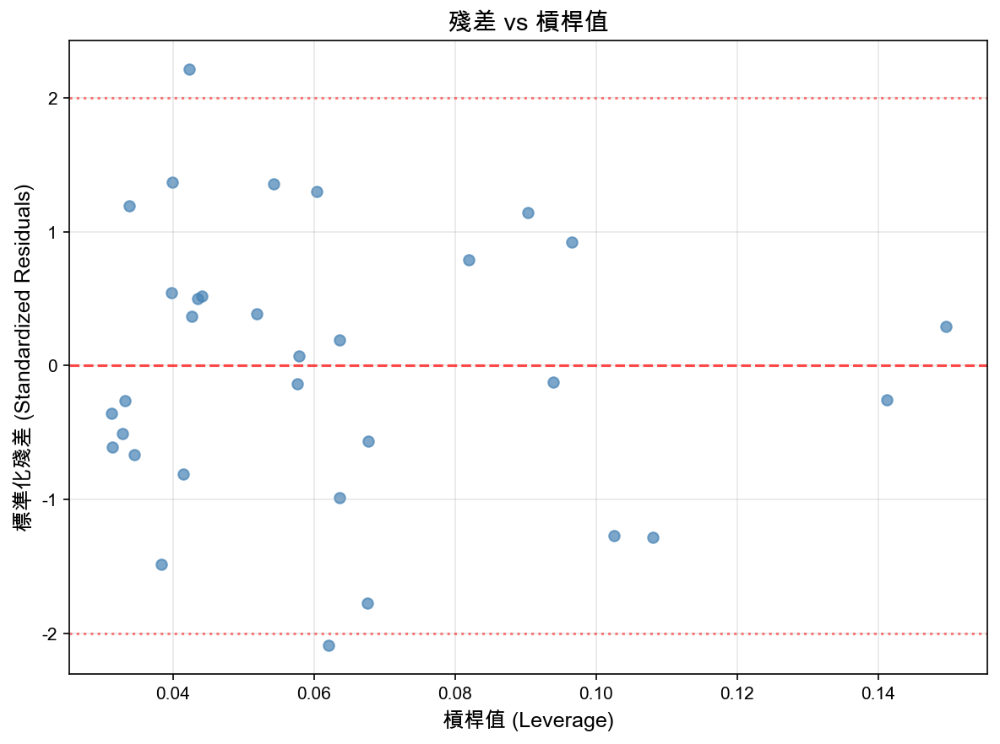
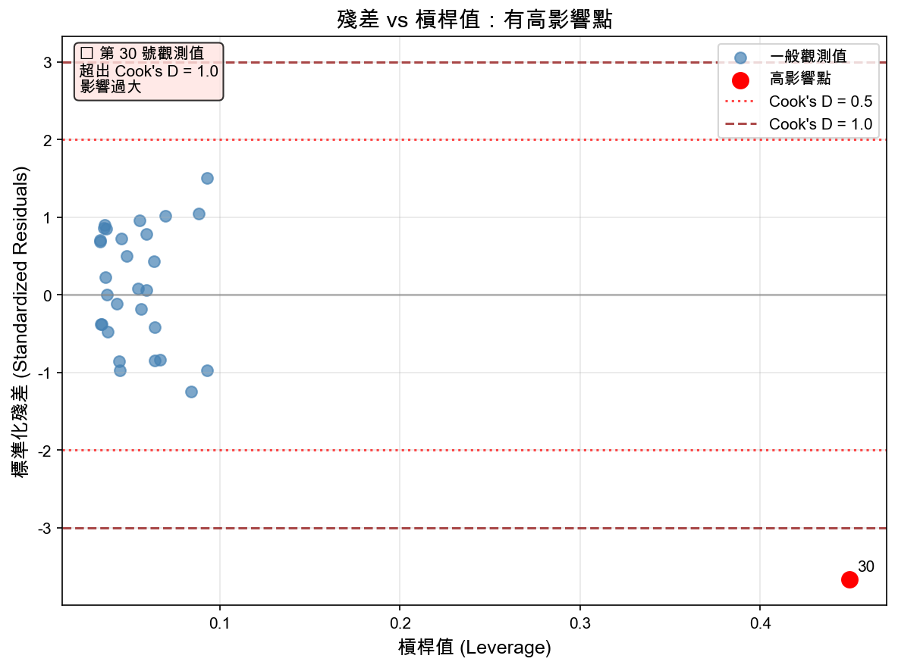

# 線性迴歸模型診斷實戰
**如何判斷你的迴歸模型可不可靠**

---
📚 **導航**：[回到目錄](./README.md) | 上一章：[理論與實作對照](./R線性迴歸理論與實作對照.md) | 下一章：[完整案例分析](./R完整案例分析實戰.md)
---

> **適用對象**：已完成前兩部分（快速上手 + 理論對照）的學生

> 📖 **閱讀方式**：
> - **GitHub 線上**：你現在就在正確的地方！繼續往下看 ✓
> - **RStudio**：在 Preview 視窗中閱讀，可直接複製程式碼執行
> - **本地閱讀器**：Typora、VS Code 等 Markdown 工具

> 📌 **學習目標**：
> - 理解為什麼 R² 高不代表模型好
> - 掌握四張診斷圖的判讀方法
> - 能偵測異常值和高影響點
> - 知道如何處理違反假設的狀況

---

## 為什麼需要模型診斷？

### ⚠️ 常見迷思

**迷思 1**：「R² = 0.75，所以這個模型很好！」

**真相**：R² 高不等於模型可靠。可能存在：
- 殘差不符合常態分配
- 異質變異數（Heteroscedasticity）
- 異常值嚴重影響結果
- 變數間有非線性關係

---

**迷思 2**：「p-value < 0.001，所以模型沒問題！」

**真相**：顯著性不代表模型假設成立。可能：
- 殘差有系統性趨勢
- 有高影響點（leverage points）
- 違反獨立性假設

---

### ✅ 正確的流程

```
1. 建立模型 (lm)
   ↓
2. 檢查 R² 和 p-value（初步評估）
   ↓
3. 模型診斷（檢查假設）⭐ ← 這一步最重要！
   ↓
4. 處理問題（轉換、移除異常值）
   ↓
5. 重新建模並驗證
```

---

## 第一部分：線性迴歸的基本假設

### OLS 假設清單

1. **線性關係**：Y 和 X 之間是線性關係
2. **獨立性**：觀測值之間互相獨立
3. **常態性**：殘差服從常態分配
4. **同質變異數**：殘差的變異數固定
5. **無完全共線性**：自變數之間不完全相關（多元迴歸）

**如何檢查？** → 使用診斷圖！

---

## 第二部分：四張診斷圖完全解析 ⭐

### 快速生成診斷圖

```r
# 建立模型
model <- lm(mpg ~ wt, data = mtcars)

# 自動產生四張診斷圖
par(mfrow = c(2, 2))  # 設定 2x2 排列
plot(model)
```

執行後會看到四張圖：


*▲ 線性迴歸的四張標準診斷圖*

1. **Residuals vs Fitted**（殘差 vs 配適值）
2. **Normal Q-Q**（常態性檢定）
3. **Scale-Location**（尺度-位置圖）
4. **Residuals vs Leverage**（殘差 vs 槓桿值）

---

### 圖 1：Residuals vs Fitted（檢查線性與同質性）⭐

#### 這張圖在看什麼？

- **X 軸**：配適值（ŷ，模型的預測值）
- **Y 軸**：殘差（y - ŷ，實際值 - 預測值）
- **紅線**：平滑曲線（LOESS）

#### 理想狀況


*▲ 殘差 vs 配適值：點隨機散佈，紅色虛線接近水平*

**判斷準則**：
- ✅ 點隨機散佈在 0 線上下
- ✅ 紅線接近水平（y = 0）
- ✅ 變異程度上下一致

---

#### 常見問題模式

**問題 1：漏斗狀（Heteroscedasticity）**

```
     殘差
      |      ·
    3 |    ·   ·
    0 |—·—————————·——
   -3 |  ·       ·  ·
      |________________
         配適值

    變異數隨 ŷ 增加 ❌
```

**原因**：異質變異數
**影響**：標準誤估計不準，假設檢定失效
**解決**：
1. 對 Y 取對數：`lm(log(y) ~ x)`
2. 使用穩健標準誤（robust SE）
3. 加權最小平方法（WLS）

---

**問題 2：曲線趨勢（非線性）**

```
     殘差
      |
    3 | ·           ·
    0 |——·——————·——— ← 紅線呈曲線
   -3 |      ·
      |________________
         配適值

    系統性彎曲 ❌
```

**原因**：Y 和 X 不是線性關係
**解決**：
1. 加入 X²：`lm(y ~ x + I(x^2))`
2. 對 X 或 Y 轉換：`lm(log(y) ~ x)` 或 `lm(y ~ log(x))`

---

#### R 實作檢查

```r
# 手動繪製 Residuals vs Fitted
model <- lm(mpg ~ wt, data = mtcars)

plot(fitted(model), residuals(model),
     xlab = "配適值",
     ylab = "殘差",
     main = "Residuals vs Fitted")
abline(h = 0, col = "red", lty = 2)  # 加上 y=0 參考線

# 加上平滑曲線
lines(lowess(fitted(model), residuals(model)), col = "blue", lwd = 2)
```

**判斷**：
- 藍線接近紅線（y=0）→ ✓ 線性假設成立
- 藍線彎曲 → ❌ 考慮非線性模型

---

### 圖 2：Normal Q-Q（檢查常態性）⭐

#### 這張圖在看什麼？

- **X 軸**：理論分位數（常態分配的理論值）
- **Y 軸**：標準化殘差（實際殘差）
- **紅色虛線**：完美常態的參考線

#### 理想狀況


*▲ 常態 Q-Q 圖：點接近對角線表示殘差呈常態分布*

**判斷準則**：
- ✅ 點大致落在紅色虛線上
- ✅ 兩端可以稍微偏離（樣本少時很正常）

---

#### 常見問題模式


*▲ 不同分配類型的 Q-Q 圖比較：理想 vs 各種問題模式*

**詳細說明：**

**問題 1：右偏（右尾翹起）**


*▲ 右偏分配：右尾明顯偏離虛線向上翹起*

**原因**：極端大值（正偏態）
**解決**：對 Y 取對數 `log(y)`

---

**問題 2：厚尾（兩端都偏離）**


*▲ 厚尾分配：兩端都偏離虛線，表示有較多極端值*

**原因**：有異常值或分配本身有厚尾特性
**解決**：檢查並考慮移除異常值

---

#### R 實作檢查

```r
# 方法 1：視覺檢查
qqnorm(residuals(model), main = "Normal Q-Q Plot")
qqline(residuals(model), col = "red")

# 方法 2：Shapiro-Wilk 檢定（數值檢定）
shapiro.test(residuals(model))

# 輸出範例：
# W = 0.94756, p-value = 0.1044
# p > 0.05 → 無法拒絕常態性假設 ✓
```

**判斷準則**：
- p-value > 0.05 → 符合常態性 ✓
- p-value < 0.05 → 違反常態性 ❌

**⚠️ 注意**：
- 小樣本（n < 30）：Shapiro-Wilk 較敏感
- 大樣本（n > 50）：輕微偏離常態影響不大（中央極限定理）

---

### 圖 3：Scale-Location（檢查同質變異數）

#### 這張圖在看什麼？

- **X 軸**：配適值
- **Y 軸**：標準化殘差的平方根（√|標準化殘差|）
- **紅線**：平滑曲線

#### 為什麼用平方根？

- 原始殘差有正有負，不容易看趨勢
- 取絕對值後開根號，放大小值、壓縮大值
- 更容易看出變異數是否改變

---

#### 理想狀況


*▲ 尺度-位置圖：紅線接近水平，點的分散程度一致*

**判斷準則**：
- ✅ 紅線接近水平
- ✅ 點的分散程度一致

---

#### 常見問題模式

**問題：紅線上升（異質變異數）**


*▲ Scale-Location 圖：紅線上升表示異質變異數（變異數遞增）*

**解決方法同圖 1**

---

#### R 實作檢查

```r
# 視覺化
plot(fitted(model), sqrt(abs(rstandard(model))),
     xlab = "配適值",
     ylab = "√|標準化殘差|",
     main = "Scale-Location Plot")
abline(h = mean(sqrt(abs(rstandard(model)))), col = "red", lty = 2)

# Breusch-Pagan 檢定（數值檢定異質變異數）
library(lmtest)
bptest(model)

# 輸出範例：
# BP = 1.2345, p-value = 0.2345
# p > 0.05 → 同質變異數 ✓
```

---

### 圖 4：Residuals vs Leverage（偵測高影響點）⭐

#### 這張圖在看什麼？

- **X 軸**：槓桿值（Leverage）
- **Y 軸**：標準化殘差
- **紅色虛線**：Cook's Distance = 0.5 和 1.0

#### 重要概念

**槓桿值（Leverage）**：
- 測量某個觀測值的「X 位置」有多極端
- 值越大 → X 值離平均值越遠 → 對迴歸線影響越大
- 範圍：0 到 1

**Cook's Distance**：
- 綜合考慮「槓桿值」和「殘差大小」
- 測量「移除某點後，迴歸線會改變多少」
- **判斷準則**：
  - D < 0.5：影響小 ✓
  - 0.5 < D < 1：需注意
  - D > 1：高影響點 ❌

---

#### 理想狀況


*▲ 殘差 vs 槓桿值：有少數點超出 ±2 臨界線，但影響不大*

---

#### 問題：有高影響點


*▲ 殘差 vs 槓桿值：第 30 號觀測值超出 Cook's Distance = 1.0 線*

**如何處理？**

1. **檢查是否為資料錯誤**
```r
# 查看該筆資料
mtcars[30, ]
```

2. **評估是否為真實異常**
   - 真實但特殊 → 考慮移除後重新分析
   - 資料錯誤 → 修正或刪除

3. **比較有無該點的模型**
```r
# 含異常值
model1 <- lm(mpg ~ wt, data = mtcars)

# 移除第 30 筆
model2 <- lm(mpg ~ wt, data = mtcars[-30, ])

# 比較係數
coef(model1)
coef(model2)
```

---

#### R 實作檢查

```r
# 計算 Cook's Distance
cooks_d <- cooks.distance(model)

# 找出 D > 0.5 的點
influential <- which(cooks_d > 0.5)
influential

# 視覺化
plot(cooks_d, type = "h", main = "Cook's Distance")
abline(h = 0.5, col = "red", lty = 2)
text(influential, cooks_d[influential], labels = influential, pos = 3)
```

---

## 第三部分：完整診斷流程示範

### 案例：mtcars 資料

```r
# 建立模型
model <- lm(mpg ~ wt, data = mtcars)

# ===== 步驟 1：四張診斷圖 =====
par(mfrow = c(2, 2))
plot(model)

# ===== 步驟 2：常態性檢定 =====
shapiro.test(residuals(model))
# p = 0.1044 > 0.05 → 符合常態性 ✓

# ===== 步驟 3：同質變異數檢定 =====
library(lmtest)
bptest(model)
# p = 0.8406 > 0.05 → 同質變異數 ✓

# ===== 步驟 4：檢查高影響點 =====
cooks_d <- cooks.distance(model)
which(cooks_d > 0.5)
# Chrysler Imperial (第17號) → 有高影響點 ❌

# ===== 步驟 5：VIF（多元迴歸才需要）=====
# 簡單迴歸跳過，多元迴歸範例：
model_multi <- lm(mpg ~ wt + hp + cyl, data = mtcars)
library(car)
vif(model_multi)
# VIF < 5 → 無共線性問題 ✓
```

---

### 診斷結果解讀

| 檢查項目       | 結果 | 判斷           |
|----------------|------|----------------|
| Residuals vs Fitted | 大致隨機，但有異常點 | △ 基本符合線性 |
| Normal Q-Q     | p = 0.1044 | ✓ 常態性成立   |
| Scale-Location | p = 0.8406 | ✓ 同質變異數   |
| Cook's Distance | Chrysler Imperial > 0.5 | ❌ 有高影響點   |

**結論**：`mpg ~ wt` 模型大致良好，但需考慮 Chrysler Imperial 的影響

---

## 第四部分：問題處理策略

> **📌 重要說明**：以下是**一般性問題**的處理方法。前面的 `mtcars` 範例實際上**沒有**異質變異數問題（p = 0.8406 > 0.05），這裡僅作為**教學示範**，讓你知道遇到這些問題時該怎麼辦。

### 問題 1：異質變異數

#### 症狀
- Residuals vs Fitted 呈漏斗狀
- Breusch-Pagan 檢定 p < 0.05

#### 解決方案

**方案 A：對數轉換**
```r
# 原模型
model1 <- lm(mpg ~ wt, data = mtcars)

# 對 Y 取對數
model2 <- lm(log(mpg) ~ wt, data = mtcars)
par(mfrow = c(1, 2))
plot(model1, which = 1, main = "原模型")
plot(model2, which = 1, main = "對數轉換")
```

---

**方案 B：穩健標準誤（Robust SE）**
```r
library(sandwich)
library(lmtest)

# 使用 HC3 穩健標準誤
coeftest(model, vcov = vcovHC(model, type = "HC3"))

# 比較原始 vs 穩健標準誤
summary(model)$coef           # 原始
coeftest(model, vcov = vcovHC(model, type = "HC3"))  # 穩健
```

---

### 問題 2：非常態殘差

#### 症狀
- Q-Q plot 兩端偏離
- Shapiro-Wilk 檢定 p < 0.05

#### 解決方案

**方案 A：轉換 Y**
```r
# Box-Cox 轉換（自動找最佳轉換）
library(MASS)
bc <- boxcox(mpg ~ wt, data = mtcars)
lambda <- bc$x[which.max(bc$y)]  # 找最佳 λ

# 使用建議的轉換
if (abs(lambda) < 0.1) {
  # λ ≈ 0 → 對數轉換
  model_new <- lm(log(mpg) ~ wt, data = mtcars)
} else {
  # 一般 Box-Cox 轉換
  model_new <- lm((mpg^lambda - 1) / lambda ~ wt, data = mtcars)
}
```

---

**方案 B：移除異常值**
```r
# 找出標準化殘差 > 2.5 的點
outliers <- which(abs(rstandard(model)) > 2.5)
outliers

# 移除後重新建模
if (length(outliers) > 0) {
  model_clean <- lm(mpg ~ wt, data = mtcars[-outliers, ])

  # 比較
  par(mfrow = c(1, 2))
  qqnorm(residuals(model), main = "含異常值")
  qqline(residuals(model))

  qqnorm(residuals(model_clean), main = "移除後")
  qqline(residuals(model_clean))
}
```

---

### 問題 3：非線性關係

#### 症狀
- Residuals vs Fitted 呈曲線

#### 解決方案

**方案 A：多項式迴歸**
```r
# 加入 X 的平方項
model_poly <- lm(mpg ~ wt + I(wt^2), data = mtcars)

# 比較配適度
summary(model)$r.squared      # 原模型
summary(model_poly)$r.squared # 多項式模型

# 檢查是否改善
par(mfrow = c(1, 2))
plot(model, which = 1, main = "線性")
plot(model_poly, which = 1, main = "多項式")
```

---

**方案 B：對 X 取對數**
```r
model_logX <- lm(mpg ~ log(wt), data = mtcars)
plot(model_logX, which = 1)
```

---

## 第五部分：實戰案例比較

### 案例：有問題的模型

```r
# 建立一個故意違反假設的模型
# 使用 cars 資料（dist ~ speed）
model_bad <- lm(dist ~ speed, data = cars)

# 診斷
par(mfrow = c(2, 2))
plot(model_bad)
```

**觀察**：
1. Residuals vs Fitted：明顯漏斗狀 ❌
2. Q-Q Plot：右尾上翹 ❌
3. Scale-Location：紅線上升 ❌

---

### 修正後的模型

```r
# 對 Y 取平方根（減少異質變異數）
model_good <- lm(sqrt(dist) ~ speed, data = cars)

# 診斷
par(mfrow = c(2, 2))
plot(model_good)
```

**觀察**：
1. Residuals vs Fitted：改善 ✓
2. Q-Q Plot：接近直線 ✓
3. Scale-Location：較水平 ✓

**比較**：
```r
# 檢定異質變異數
bptest(model_bad)   # p = 0.0269 ❌
bptest(model_good)  # p = 0.2346 ✓

# R² 比較
summary(model_bad)$r.squared   # 0.6511
summary(model_good)$r.squared  # 0.6438（略降，但模型更可靠）
```

**結論**：R² 略降，但模型假設成立，推論更可靠 ✓

---

## 第六部分：診斷檢查清單

### 📋 模型診斷 Checklist

每次建立迴歸模型後，請完成以下檢查：

```r
# ===== 自動診斷腳本 =====

diagnose_model <- function(model) {
  cat("========== 模型診斷報告 ==========\n\n")

  # 1. 四張診斷圖
  par(mfrow = c(2, 2))
  plot(model)

  # 2. 常態性檢定
  cat("1. 常態性檢定 (Shapiro-Wilk):\n")
  shapiro_result <- shapiro.test(residuals(model))
  print(shapiro_result)
  if (shapiro_result$p.value > 0.05) {
    cat("   → ✓ 符合常態性\n\n")
  } else {
    cat("   → ❌ 違反常態性（考慮轉換或移除異常值）\n\n")
  }

  # 3. 異質變異數檢定
  cat("2. 異質變異數檢定 (Breusch-Pagan):\n")
  library(lmtest)
  bp_result <- bptest(model)
  print(bp_result)
  if (bp_result$p.value > 0.05) {
    cat("   → ✓ 同質變異數\n\n")
  } else {
    cat("   → ❌ 異質變異數（考慮對數轉換或穩健標準誤）\n\n")
  }

  # 4. 高影響點
  cat("3. 高影響點檢查 (Cook's Distance):\n")
  cooks_d <- cooks.distance(model)
  influential <- which(cooks_d > 0.5)
  if (length(influential) == 0) {
    cat("   → ✓ 無高影響點\n\n")
  } else {
    cat("   → ❌ 發現高影響點:", influential, "\n")
    cat("      請檢查這些觀測值是否為資料錯誤\n\n")
  }

  # 5. 多元迴歸：VIF
  if (length(coef(model)) > 2) {
    cat("4. 共線性檢查 (VIF):\n")
    library(car)
    vif_values <- vif(model)
    print(vif_values)
    if (all(vif_values < 5)) {
      cat("   → ✓ 無共線性問題\n\n")
    } else {
      cat("   → ❌ 發現共線性（VIF > 5）\n\n")
    }
  }

  cat("========== 診斷完成 ==========\n")
}

# 使用範例
model <- lm(mpg ~ wt, data = mtcars)
diagnose_model(model)
```

---

## 🎯 練習題

### 練習 1：診斷 women 資料

```r
# 建立模型
model <- lm(weight ~ height, data = women)

# 任務：
# 1. 繪製四張診斷圖
# 2. 進行 Shapiro-Wilk 和 Breusch-Pagan 檢定
# 3. 判斷模型是否可靠
```

<details>
<summary>點擊查看解答</summary>

```r
# 診斷
par(mfrow = c(2, 2))
plot(model)

shapiro.test(residuals(model))
# W = 0.9191, p-value = 0.1866 → ✓ 常態性

library(lmtest)
bptest(model)
# BP = 1.0088, p-value = 0.3152 → ✓ 同質變異數

# 結論：模型通過所有診斷 ✓
# R² = 0.991（解釋力極高，身高與體重線性關係強）
```

</details>

---

### 練習 2：修正有問題的模型

```r
# 建立有問題的模型
model_bad <- lm(dist ~ speed, data = cars)

# 任務：
# 1. 診斷問題
# 2. 選擇適當轉換
# 3. 驗證改善效果
```

<details>
<summary>點擊查看解答</summary>

```r
# 診斷原始模型
par(mfrow = c(2, 2))
plot(model_bad)

library(lmtest)
bptest(model_bad)  # p = 0.073 → 邊緣通過，但常態性有問題
shapiro.test(residuals(model_bad))  # p = 0.022 → 常態性 ❌

# 方案 1：平方根轉換（推薦）
model_sqrt <- lm(sqrt(dist) ~ speed, data = cars)
bptest(model_sqrt)  # p = 0.916 → 異質變異數大幅改善 ✓
shapiro.test(residuals(model_sqrt))  # p = 0.314 → 常態性改善 ✓
# R² = 0.709（比原始 0.651 更好）

# 方案 2：對數轉換（不推薦）
model_log <- lm(log(dist) ~ speed, data = cars)
bptest(model_log)  # p = 0.004 → 異質變異數變嚴重 ❌
shapiro.test(residuals(model_log))  # p = 0.069 → 勉強通過

# 結論：平方根轉換是最佳解決方案
```

</details>

---

## 📚 總結

### 你學到了什麼？

✅ **診斷圖判讀**
- Residuals vs Fitted → 線性與同質性
- Normal Q-Q → 常態性
- Scale-Location → 變異數穩定性
- Residuals vs Leverage → 高影響點

✅ **數值檢定**
- Shapiro-Wilk（常態性）
- Breusch-Pagan（異質變異數）
- Cook's Distance（影響點）

✅ **問題處理**
- 對數/平方根轉換
- 多項式迴歸
- 穩健標準誤
- 移除異常值

---

### 重要提醒

> **模型診斷比 R² 更重要！**
>
> 一個 R² = 0.6 但通過所有診斷的模型，
> 比 R² = 0.9 但違反假設的模型更可靠。

---

**文件版本**：v1.0
**最後更新**：2025-11-07
**預計學習時間**：35-45 分鐘
**難度**：⭐⭐⭐⭐☆（中高級）
**前置需求**：完成前兩部分（快速上手 + 理論對照）
